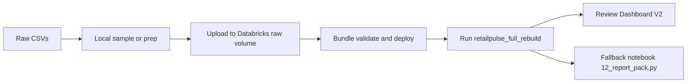

# How To Use RetailPulse

<p align="center">
  
</p>

This guide explains how to rerun the current RetailPulse workflow, how to adapt it to a new dataset today, and what the planned self-service future flow looks like.

- Main project page: [README.md](README.md)
- Technical study and outputs: [RESULTS_README.md](RESULTS_README.md)

## What Works Today

### Implemented now
- Deterministic local sampling of the Instacart dataset
- Databricks bundle validate, deploy, and run flow
- Manual raw CSV upload into the expected Databricks volume
- Full end-to-end notebook sequence with Dashboard V2 and report-pack fallback
- Optional local tooling container through `Dockerfile.quickstart`

### Validated now
- Latest successful run id: `631388168060027`
- Job id: `61936309152043`
- Dashboard V2 published and reviewable
- Local validation commands and notebook exporter checks are already part of the repo workflow

### Planned next
- Self-service upload and mapping UI for new retail datasets
- Generic multi-dataset processing behind a canonical retail contract
- More automated artifact packaging per dataset

## What The Current System Actually Expects

Today’s pipeline is still Instacart-shaped. That means:

- file names are fixed
- schemas are fixed
- the manual upload checkpoint is real
- adapting a different retail dataset today requires transformation work before upload or code changes in the early notebooks

The current workflow is excellent for the validated study. It is not yet a plug-and-play “upload any retail CSV” product.

## Minimum Data Contract For A New Dataset

If you want to adapt RetailPulse to a different retail source today, this is the minimum grain you should target:

| Requirement | Status | Notes |
| --- | --- | --- |
| Order-item grain | Required | One row per order-product line is the safest fit |
| Order identifier | Required | Needed for basket construction |
| Product identifier | Required | Needed for recommendation, top products, and dimensions |
| Customer identifier | Required | Needed for user behavior and segmentation |
| Quantity | Required | Needed for item-count and basket metrics |
| Timestamp or date plus hour | Strongly preferred | Needed for timing, daypart, and order pattern visuals |
| Price | Optional | The current project does not depend on it |

## Pipeline Overview



## How To Rerun On Instacart

### 1. Install prerequisites
- Git
- Python 3.11 or newer
- Databricks CLI `0.205.x` or newer

### 2. Clone the repo

```powershell
git clone https://github.com/The-Harsh-Vardhan/RetailPulse.git
cd RetailPulse
```

### 3. Download the raw Instacart CSV files

Expected inputs:
- `orders.csv`
- `order_products__prior.csv`
- `order_products__train.csv`
- `products.csv`
- `aisles.csv`
- `departments.csv`

### 4. Build the deterministic 10% sample locally

```powershell
python scripts/sample_instacart.py `
  --input-dir C:\path\to\instacart_raw `
  --output-dir C:\path\to\retailpulse_sample
```

### 5. Run local validation

```powershell
python -m unittest -q tests.test_sample_instacart tests.test_split_stream_replay_batches tests.test_export_databricks_source_to_ipynb
$files = @((Get-ChildItem notebooks -Filter *.py).FullName) + @((Get-ChildItem scripts -Filter *.py).FullName) + @((Get-ChildItem tests -Filter *.py).FullName)
python -m py_compile $files
python scripts/export_databricks_source_to_ipynb.py --check
```

### 6. Authenticate Databricks CLI

Preferred:

```powershell
databricks auth login --host https://<your-workspace-host>
```

Fallback:

```powershell
databricks configure --host https://<your-workspace-host>
```

### 7. Validate and deploy the bundle

```powershell
databricks bundle validate -t dev
databricks bundle deploy -t dev
```

### 8. Run the setup notebook once and upload sampled CSVs

The bundle deploy creates the workspace artifacts, but the data upload checkpoint is still manual.

Upload the sampled CSVs to the raw volume path expected by the notebooks:

```text
/Volumes/<catalog>/<schema>/<raw_volume>/
```

### 9. Run the full Databricks workflow

```powershell
databricks bundle run retailpulse_full_rebuild -t dev
```

### 10. Review the outputs

Use this order:

1. `RetailPulse Demo Dashboard`
2. `notebooks/12_report_pack.py`
3. `assets/screenshots/`
4. `Docs/current-production-state.md`

## Optional Docker Quickstart

`Dockerfile.quickstart` exists for local tooling parity. It is useful when you want a clean environment for:

- Python validation
- notebook mirror export
- Databricks CLI commands

It does **not** run Spark or the Databricks pipeline locally. Databricks remains the compute backend.

Build the image:

```powershell
docker build -f Dockerfile.quickstart -t retailpulse-quickstart .
```

Run it against the current repo:

```powershell
docker run --rm -it `
  -v "${PWD}:/workspace/RetailPulse" `
  -w /workspace/RetailPulse `
  retailpulse-quickstart bash
```

Example commands inside the container:

```bash
python -m unittest -q tests.test_sample_instacart tests.test_split_stream_replay_batches tests.test_export_databricks_source_to_ipynb
python scripts/export_databricks_source_to_ipynb.py --check
databricks version
```

## How To Adapt To A New Dataset Today

### What is realistic today
- You can adapt a new dataset if it has order-item grain and can be reshaped into the current Instacart-like structure.
- You should expect manual mapping and some notebook-level changes, especially in the early ingest stages.

### What usually needs work
- Rename or reshape columns into the expected current fields
- Create equivalent product and department lookup files if the source does not already separate them
- Derive timing fields if the source uses timestamps instead of `order_dow` and `order_hour_of_day`
- Revisit early notebooks if your source differs materially from Instacart semantics

### Not recommended right now
- Pretending the current repo already supports arbitrary retail CSV upload with zero code changes
- Feeding summary-only store extracts that do not have order-item grain
- Routing operational decisions through the current `Experimental Insights` models

## Planned Self-Service Future Workflow

The next intended product step is:

1. upload one or more retail CSVs through a UI
2. assign file roles and map columns into a canonical retail contract
3. validate schema fit and data quality
4. trigger Databricks processing automatically
5. publish a dataset-aware dashboard and artifact pack

That future system is planned, not implemented today.

## Run Order Block

```text
Clone repo
-> sample Instacart locally
-> run local validation
-> authenticate Databricks CLI
-> bundle validate
-> bundle deploy
-> upload sampled CSVs manually
-> bundle run retailpulse_full_rebuild
-> review Dashboard V2
-> use 12_report_pack.py only as fallback
```

## More Detailed Docs

- [Docs/RetailPulse Handbook.md](Docs/RetailPulse%20Handbook.md)
- [Docs/rebuild-from-scratch.md](Docs/rebuild-from-scratch.md)
- [Docs/current-production-state.md](Docs/current-production-state.md)
- [Docs/production-runbook.md](Docs/production-runbook.md)
- [Docs/release-checklist.md](Docs/release-checklist.md)
