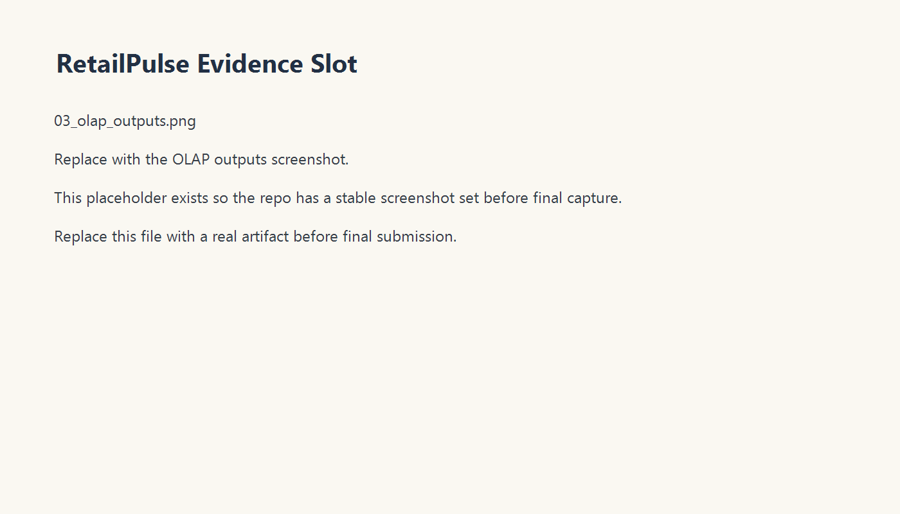
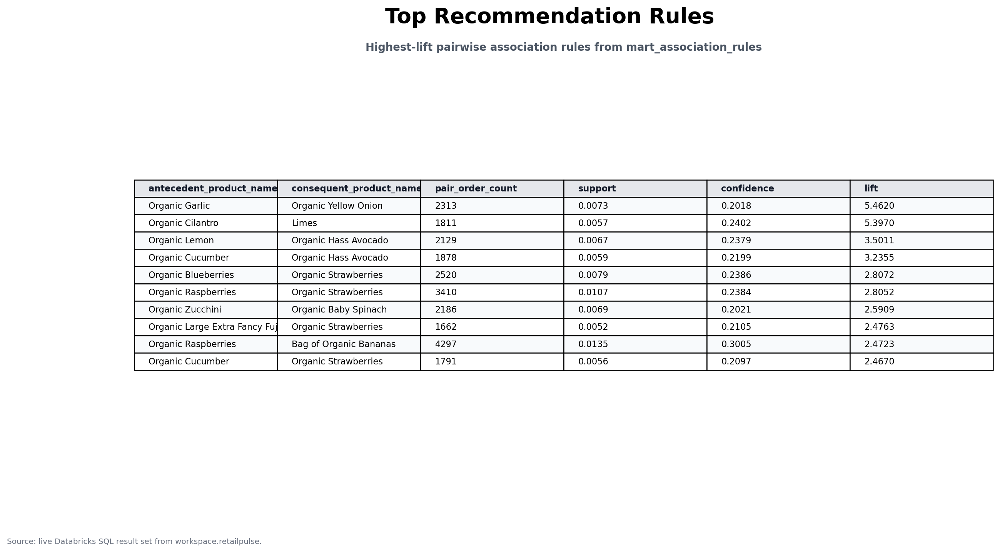
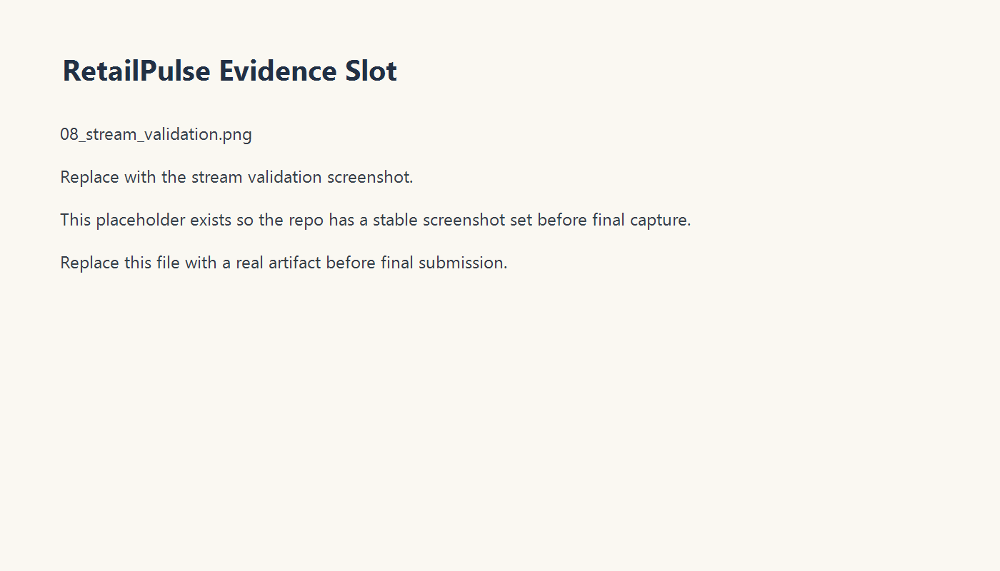
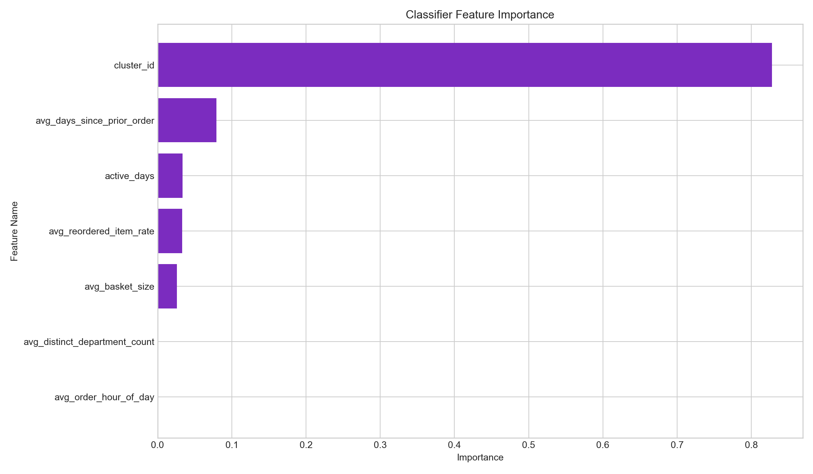
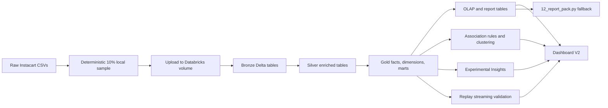

# RetailPulse

  

<strong>Retail analytics, recommendation, and dashboarding on Databricks.</strong>

RetailPulse is a Databricks-first retail analytics project built around a validated Instacart implementation. It takes grocery order history through a bronze, silver, and gold Delta pipeline, persists OLAP and report tables, surfaces cross-sell recommendations and customer segments, validates a replay-style streaming flow, and publishes a five-page AI/BI dashboard for review.

This repository is now packaged for GitHub in three layers:
- [README.md](README.md): the project story and journey from idea to implementation
- [RESULTS_README.md](RESULTS_README.md): the Databricks study, visuals, and validated results
- [HOW_TO_USE_README.md](HOW_TO_USE_README.md): the operator guide for rerunning the workflow and adapting it to a new dataset

## At A Glance

### Implemented now
- Deterministic 10% Instacart sampling flow
- Databricks Asset Bundle deployment and sequential rebuild job
- Bronze, silver, and gold Delta pipeline
- Star schema, OLAP report tables, association rules, clustering, streaming validation, and optimize evidence
- Dashboard V2 with five reviewer-facing pages
- Notebook fallback via `notebooks/12_report_pack.py`

### Validated now
- Workspace target: Databricks Free Edition serverless
- Job id: `61936309152043`
- Latest successful run id: `631388168060027`
- Published dashboard: `RetailPulse Demo Dashboard`
- Dashboard id: `01f1305e8f1a115e8fb2b378bd4d8f99`
- Dashboard revision: `2026-04-05T08:40:02.619Z`

### Planned next
- Self-service dataset upload and mapping flow for non-Instacart retail datasets
- Dataset-aware multi-store operation behind a canonical retail contract
- Optional external BI layer after the Databricks story is fully stable

## Visual Overview

| Executive overview | Recommendations and segments |
| --- | --- |
|  |  |

| Execution and data quality | Experimental insights |
| --- | --- |
|  |  |

For the full evidence set, use [RESULTS_README.md](RESULTS_README.md) and [Docs/evidence-pack.md](Docs/evidence-pack.md).

## From Idea To Implementation

RetailPulse started as a 2-week Databricks warehouse project idea: take a public retail-like dataset, prove a proper medallion pipeline, build analytics tables that are actually reviewable, and package the work so it survives beyond a notebook demo. The project then evolved through four stages:

1. `Foundation`: deterministic sampling, Databricks bundle deployment, bronze-silver-gold pipeline, and star schema.
2. `Analytics`: OLAP outputs, pairwise association-rule mining, clustering, replay-style streaming validation, and optimization evidence.
3. `Presentation`: screenshot pack, report-pack notebook, published Databricks AI/BI dashboard, and GitHub-facing docs.
4. `Release hardening`: release checklist, production-state docs, smoke checks, boss-facing walkthrough, and Dashboard V2 polish.

The result is a repo that is not just “some notebooks,” but a packaged analytics system with a validated live run and a reviewable evidence trail.

## Architecture

Assets:
- [retailpulse_medallion.mmd](assets/retailpulse_medallion.mmd)
- [retailpulse_star_schema.mmd](assets/retailpulse_star_schema.mmd)

## Open These First

If you are reviewing the repo on GitHub, use this order:

1. [RESULTS_README.md](RESULTS_README.md)
2. [HOW_TO_USE_README.md](HOW_TO_USE_README.md)
3. [Docs/showcase-summary.md](Docs/showcase-summary.md)
4. [Docs/RetailPulse Handbook.md](Docs/RetailPulse%20Handbook.md)
5. [Docs/current-production-state.md](Docs/current-production-state.md)

## Dashboard V2 Story

The live Databricks dashboard is organized into five pages:

1. `Executive Overview`
2. `Order Behavior`
3. `Recommendations And Segments`
4. `Execution And Data Quality`
5. `Experimental Insights And Performance`

That same page order is mirrored in the packaged evidence and the fallback notebook.

## Current Vs Future

### Current repo truth
- The repo contains a validated Instacart implementation on Databricks.
- The live dashboard, screenshot pack, and report-pack notebook are all real and aligned.
- Classifier and regression outputs remain in an `Experimental Insights` lane.

### Future system goal
- A self-service upload and mapping system where a retailer can provide order-item CSVs and RetailPulse can normalize them, analyze them, publish a dashboard, and produce actionable output files.

That future system is planned next. It is not already implemented in this repository.

## Explore Further

### Project story and results
- [RESULTS_README.md](RESULTS_README.md)
- [Docs/showcase-summary.md](Docs/showcase-summary.md)
- [Docs/boss-brief.md](Docs/boss-brief.md)

### Running and adapting the workflow
- [HOW_TO_USE_README.md](HOW_TO_USE_README.md)
- [Docs/RetailPulse Handbook.md](Docs/RetailPulse%20Handbook.md)
- [Docs/rebuild-from-scratch.md](Docs/rebuild-from-scratch.md)

### Live-state and release docs
- [Docs/current-production-state.md](Docs/current-production-state.md)
- [Docs/production-runbook.md](Docs/production-runbook.md)
- [Docs/release-checklist.md](Docs/release-checklist.md)
- [sql/release_smoke_checks.sql](sql/release_smoke_checks.sql)

## Honesty Rules

- RetailPulse currently proves a validated Instacart analytics implementation, not a generic upload-any-retail-CSV product.
- Dashboard V2 is implemented and validated now.
- The generic self-service uploader and mapper are planned next.
- The supervised ML outputs are exploratory and are not operational decision drivers in the current release.
