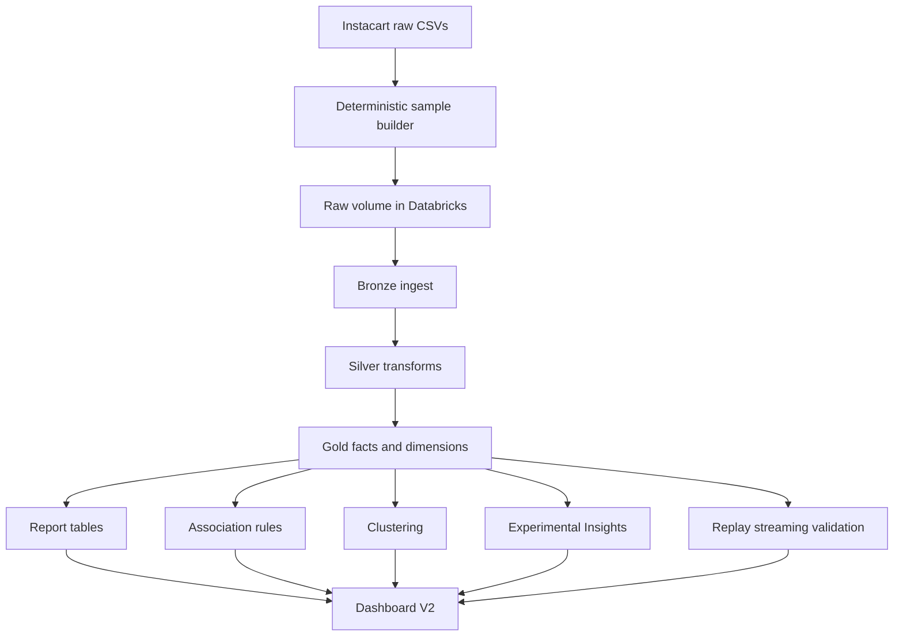
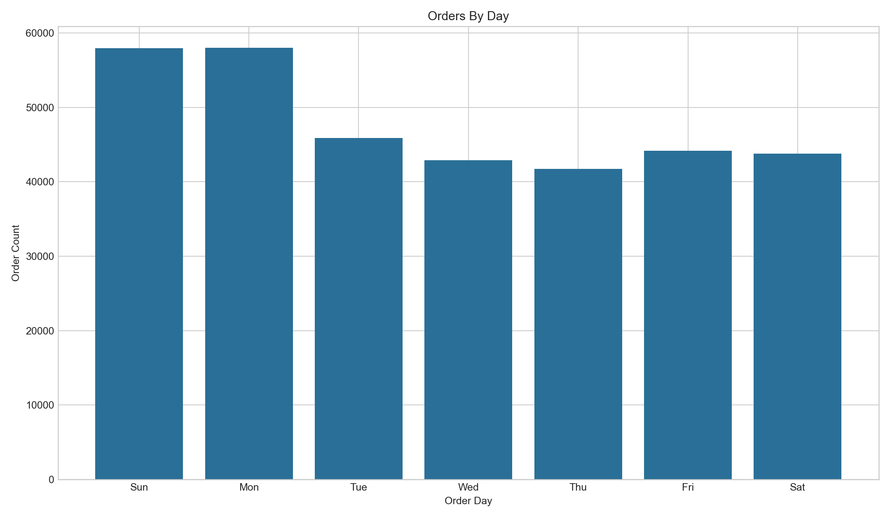
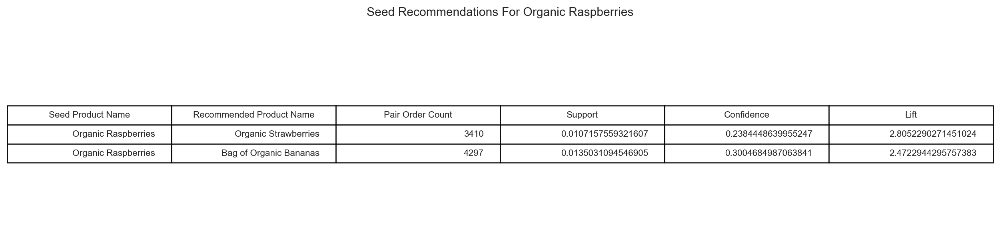
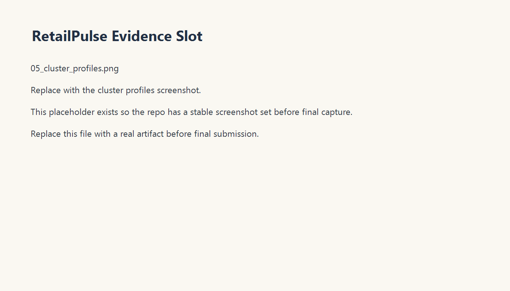
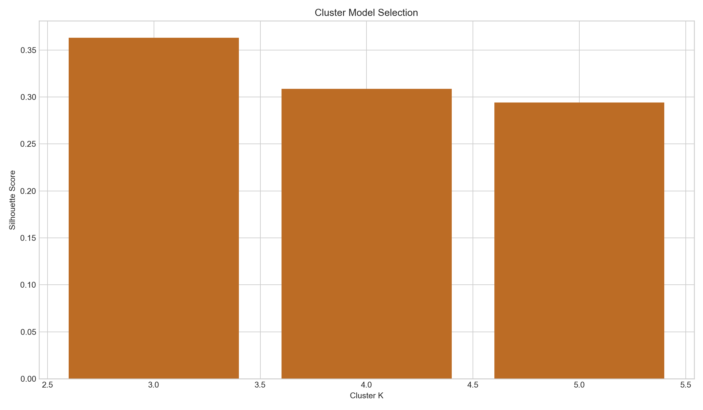
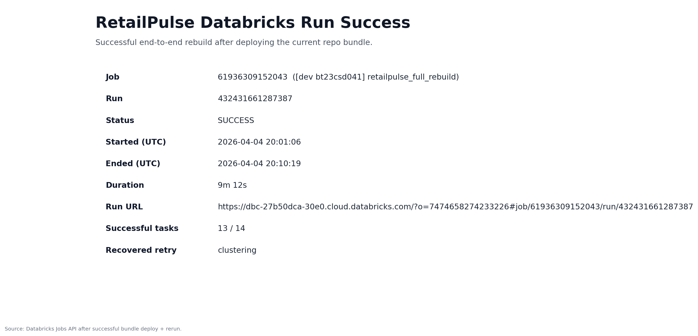
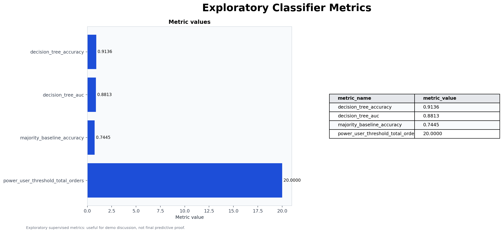
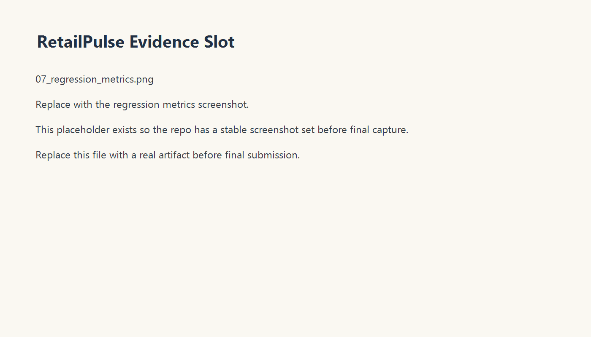
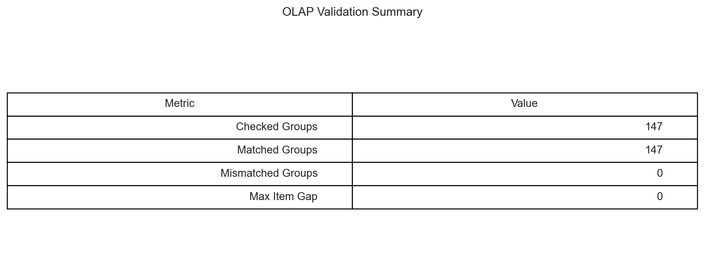

# RetailPulse Results

  

  
  
  

This is the technical showcase for the validated RetailPulse implementation on Databricks using the Instacart dataset.

- Main landing page: [README.md](README.md)
- Operator and rerun guide: [HOW TO USE.md](HOW%20TO%20USE.md)

## Study Scope

### Implemented now
- A Databricks medallion pipeline over a deterministic 10% Instacart sample
- A star-schema analytics layer with persisted report tables
- Pairwise association-rule mining, KMeans segmentation, replay-style streaming validation, and optimize benchmarking
- Dashboard V2 plus notebook fallback

### Validated now
- Latest successful run id: `631388168060027`
- Job id: `61936309152043`
- Dashboard: `RetailPulse Demo Dashboard`
- Dashboard revision: `2026-04-05T08:40:02.619Z`

### Planned next
- Generic self-service retail upload and mapping
- Multi-dataset operation keyed by `dataset_id`
- Stronger external BI packaging after the Databricks surface is stable

## Problem Statement

The project goal was to build a warehouse-style retail analytics system that can be defended both technically and operationally:

- ingest and model retail order data in Databricks
- expose dimensional analytics, behavioral patterns, recommendation evidence, and segmentation
- validate correctness through replay-style streaming checks and report tables
- package the work for GitHub review, boss review, and repeatable rebuilds

## Why Instacart And Why Databricks

### Why Instacart
- Publicly available retail-like order history
- Strong order-item grain for basket analytics
- Suitable for recommendations and clustering
- Good fit for a warehouse-style medallion design

### Why Databricks
- Native Delta pipeline and SQL warehouse flow
- Asset Bundles for reproducible deployment
- AI/BI dashboards for an integrated review surface
- Enough platform surface to demonstrate engineering, analytics, and presentation in one place

## Dataset Constraints

The project is intentionally honest about the source data:

- Instacart does not include raw prices or revenue.
- Instacart does not include absolute calendar dates.
- RetailPulse therefore focuses on item counts, basket size, reorder behavior, day-of-week, hour-of-day, and days-since-prior-order.

This is why the project should be described as grocery order analytics and recommendation, not revenue analytics.

## Architecture Summary

## Sample Scope

| Sample output | Rows |
| --- | ---: |
| `orders.csv` | 341,974 |
| `order_products__prior.csv` | 3,267,191 |
| `order_products__train.csv` | 137,847 |

## Dashboard V2 Showcase

| Executive overview | Order behavior |
| --- | --- |
|  |  |

| Recommendations and segments | Execution and quality |
| --- | --- |
|  |  |

## Final Table Outputs

| Table | Rows |
| --- | ---: |
| `bronze_orders` | 341,974 |
| `silver_order_items` | 3,405,038 |
| `fact_order_items` | 3,405,038 |
| `fact_orders` | 334,438 |
| `mart_association_rules` | 49 |
| `report_cluster_profiles` | 3 |
| `report_cluster_k_scores` | 3 |
| `report_stream_validation` | 158 |
| `report_optimize_summary` | 2 |
| `report_classifier_feature_importance` | 7 |

## OLAP Results

RetailPulse persists OLAP outputs rather than using notebook-only screenshots. The project writes:

- `report_olap_cube`
- `report_olap_rollup`
- `report_olap_basket`
- `report_olap_validation`

Representative business outcomes from the validated run:

| Department | Item count | Average basket size |
| --- | ---: | ---: |
| Produce | 989,427 | 15.6053 |
| Dairy eggs | 564,570 | 15.7091 |
| Snacks | 307,015 | 16.4833 |
| Beverages | 286,615 | 14.4986 |
| Frozen | 235,565 | 16.3924 |

Visual evidence:

## Recommendation Results

The recommendation path uses serverless-safe pairwise association-rule mining instead of FP-growth. That decision traded algorithmic breadth for platform reliability and still produced useful recommendation evidence.

Top rules from the validated run:

| Antecedent | Consequent | Support | Confidence | Lift |
| --- | --- | ---: | ---: | ---: |
| Organic Garlic | Organic Yellow Onion | 0.0073 | 0.2018 | 5.4620 |
| Organic Cilantro | Limes | 0.0057 | 0.2402 | 5.3970 |
| Organic Lemon | Organic Hass Avocado | 0.0067 | 0.2379 | 3.5011 |
| Organic Cucumber | Organic Hass Avocado | 0.0059 | 0.2199 | 3.2355 |
| Organic Blueberries | Organic Strawberries | 0.0079 | 0.2386 | 2.8072 |
| Organic Raspberries | Organic Strawberries | 0.0107 | 0.2384 | 2.8052 |

Example seed-product result for `Organic Raspberries`:
- `Bag of Organic Bananas` with confidence `0.3005` and lift `2.4723`
- `Organic Strawberries` with confidence `0.2384` and lift `2.8052`

Visual evidence:

| Top rules | Seed recommendations |
| --- | --- |
|  |  |

## Clustering Results

KMeans produced three interpretable shopper segments:

| Segment | Users | Avg total orders | Avg basket size | Reorder rate | Interpretation |
| --- | ---: | ---: | ---: | ---: | --- |
| Cluster 0 | 6,440 | 33.2807 | 9.1985 | 0.6521 | Frequent loyal shoppers |
| Cluster 1 | 9,050 | 7.5448 | 6.6317 | 0.3594 | Light occasional shoppers |
| Cluster 2 | 5,130 | 10.1033 | 17.1178 | 0.4402 | Large-basket stock-up shoppers |

Dashboard V2 also exposes cluster-model-selection evidence using `report_cluster_k_scores`.

Visual evidence:

| Segment profiles | Cluster k-selection |
| --- | --- |
|  |  |

## Streaming Validation

The streaming notebook uses `Trigger.AvailableNow` to stay compatible with Databricks Free Edition serverless limits. The important outcome is correctness, not raw throughput.

Validated result:
- `158` checked stream-vs-batch groups
- `0` mismatches

Visual evidence:

| Run proof | Streaming quality |
| --- | --- |
|  |  |

## Optimization Benchmark

`OPTIMIZE` and `ZORDER BY` ran successfully and the project records the measured outcome honestly.

| Query | Before optimize | After optimize | Seconds saved | Speedup ratio |
| --- | ---: | ---: | ---: | ---: |
| `department_hour_distribution` | 0.6994 | 0.8350 | -0.1356 | 0.8376 |
| `user_basket_summary` | 0.6828 | 0.9789 | -0.2961 | 0.6975 |

The benchmark was slower on this small sample. That is not a failure of documentation; it is a sign the repo is not hiding inconvenient results.

Visual evidence:

## Dashboard V2 Page Map

1. `Executive Overview`
2. `Order Behavior`
3. `Recommendations And Segments`
4. `Execution And Data Quality`
5. `Experimental Insights And Performance`

This page order is shared across the live dashboard, the screenshot pack, the fallback notebook, and the GitHub packaging.

## Experimental Insights

Classifier and regression results are exploratory and useful for demo discussion, but not final predictive proof. Methodology tightening is still pending.

Current exploratory metrics:

| Model | Metric | Value |
| --- | --- | ---: |
| Decision tree | Accuracy | 0.9136 |
| Decision tree | AUC | 0.8813 |
| Majority baseline | Accuracy | 0.7445 |
| Linear regression | R² | 0.5580 |
| Linear regression | RMSE | 5.0945 |
| Mean baseline | RMSE | 7.6627 |

Visual evidence:

| Classifier metrics | Feature importance |
| --- | --- |
|  |  |

| Regression metrics | OLAP validation |
| --- | --- |
|  |  |

These outputs remain in the repo because they are informative, but they are not operational release gates.

## Limitations And Lessons Learned

### Implemented now
- Honest handling of Instacart limits
- Serverless-safe recommendation path
- Persisted report tables and repeatable rebuild flow

### Validated now
- Dashboard V2 is live and backed by report tables
- Streaming replay correctness is proven for the validated run
- GitHub packaging and evidence now match the live workspace story

### Planned next
- Generic retail upload and mapping flow
- Dataset-aware multi-store operation
- Leakage-safe supervised redesign if predictive rigor becomes a priority

## Where To Go Next

- Project front door: [README.md](README.md)
- Operator guide: [HOW TO USE.md](HOW%20TO%20USE.md)
- Deep showcase doc: [Docs/showcase-summary.md](Docs/showcase-summary.md)
- Evidence catalog: [Docs/evidence-pack.md](Docs/evidence-pack.md)
